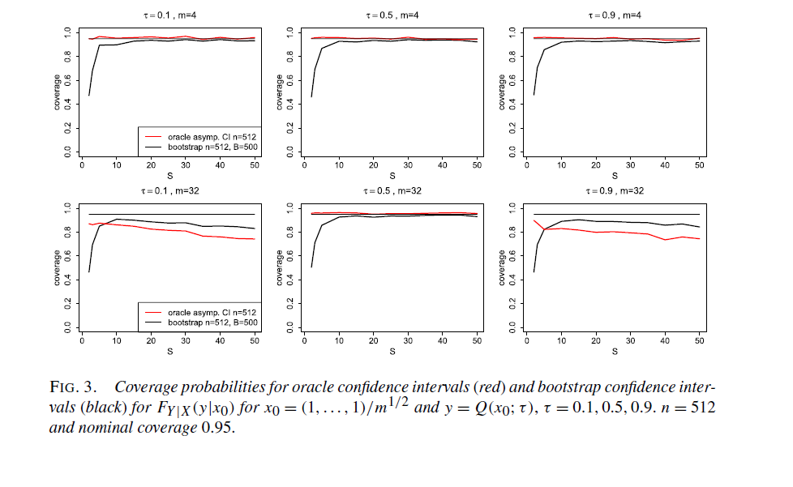

\titlepage
Introduction
============

Quantile Regression Given data $\{X_i,Y_i\}$,quantile regression for
such models is classically formulated through the following minimization
problem: 

$$\tag{1.1}
\widehat{\boldsymbol{\beta}}_{o r}(\tau):=\arg \min _{\mathbf{b} \in \mathbb{R}^{m}} \sum_{i=1}^{N} \rho_{\tau}\left\{Y_{i}-\mathbf{b}^{\top} \mathbf{Z}\left(X_{i}\right)\right\},$$
where $\rho_{\tau}(u):=:=\{\tau-\mathbf{1}(u \leq 0)\} u$.

## Divide and Conquer

-   $N=Sn$ 总共$N$个数据，$S$个机器，每个机器 $n$ 个观测.

-   对每个机器上的数据分别做分位数回归，然后将求出来的系数做平均。

Notation

-   Let $\mathcal{X}:=supp(X)$.

-   Let $Z=Z(X)$ and $Z_i=Z(X_i)$ and assume
    $\mathcal{T}=\left[\tau_{L}, \tau_{U}\right]$ for some
    $0<\tau_L<\tau_U<1$.

-   $\mathcal{S}^{m-1} \subset \mathbb{R}^{m}$ is the unit sphere.

-   $a_{n} \asymp b_{n}$ means that
    $\left(\left|a_{n} / b_{n}\right|\right)_{n \in \mathbb{N}}$ and
    $\left(\left|b_{n} / a_{n}\right|\right)_{n \in \mathbb{N}}$ are
    bounded.

-   Define the class of functions $$\begin{array}{c}
    \Lambda_{c}^{\eta}(\mathcal{T}):=\left\{f \in \mathcal{C}^{\lfloor\eta\rfloor}(\mathcal{T}): \sup _{j \leq\lfloor\eta\rfloor } \sup_{\tau \in \mathcal{T}} \left|D^{j} f(\tau)\right| \leq c\right. \\
    \left.\sup _{j=\lfloor\eta \rfloor}\sup_{ \tau \neq \tau^{\prime}} \frac{\left|D^{j} f(\tau)-D^{j} f\left(\tau^{\prime}\right)\right|}{\left\|\tau-\tau^{\prime}\right\|^{\eta-\lfloor\eta\rfloor}} \leq c\right\},
    \end{array}$$ where $\eta$ is called the \"degree of Hölder
    continuity\", and $\mathcal{C}^{\alpha}(\mathcal{X})$ denotes the
    class of $\alpha$-continuously differentiable functions on a set
    $\mathcal{X}$.

A two step Procedure
====================

The divide and conquer algorithm

-   Divide the data $\{(X_i,Y_i)\}_{i=1}^N$ into $S$ sub-samples of size
    $n$. Denote the $s$-th sub-sample as
    $\left\{\left(X_{i s}, Y_{i s}\right)\right\}_{i=1}^{n}$ where
    $s=1,2,\dots,S$.

-   For each $s$ and $\tau$, estimate the sub-sample based quantile
    regression coefficient as follows:
    $$\widehat{\boldsymbol{\beta}}^{s}(\tau):=\arg \min _{\boldsymbol{\beta} \in \mathbb{R}^{m}} \sum_{i=1}^{n} \rho_{\tau}\left\{Y_{i s}-\boldsymbol{\beta}^{\top} \mathbf{Z}\left(X_{i s}\right)\right\}.$$

-   Each local machine sends
    $\widehat{\boldsymbol{\beta}}^{s}(\tau) \in \mathbb{R}^{m}$ to the
    master that outputs a pooled estimator
    $$\overline{\boldsymbol{\beta}}(\tau):=S^{-1} \sum_{s=1}^{S} \widehat{\boldsymbol{\beta}}^{s}(\tau).$$

Quantile Projection

-   While $\bar{\beta}(\tau)$ gives an estimator at a fixed
    $\tau\in \mathcal{T}$, a complete picture of the conditional
    distribution is often desirable.

-   To achieve this, we propose a two-step procedure. First compute
    $\overline{\boldsymbol{\beta}}\left(\tau_{k}\right) \in \mathbb{R}^{m}$
    for each $\tau_{k} \in \mathcal{T}_{K}$, where
    $\mathcal{T}_{K} \subset \mathcal{T}=\left[\tau_{L}, \tau_{U}\right]$
    is grid of quantile values in $\mathcal{T}$ with
    $|\mathcal{T}_K|=K\in \mathbb{N}$.

-   Second project each component of the vectors
    $\left\{\overline{\boldsymbol{\beta}}\left(\tau_{1}\right), \ldots, \overline{\boldsymbol{\beta}}\left(\tau_{K}\right)\right\}$
    on a space of spline functions in $\tau$.

Quantile Projection Let
$$\widehat{\boldsymbol{\alpha}}_{j}:=\arg \min _{\boldsymbol{\alpha} \in \mathbb{R}^{q}} \sum_{k=1}^{K}\left(\bar{\beta}_{j}\left(\tau_{k}\right)-\boldsymbol{\alpha}^{\top} \mathbf{B}\left(\tau_{k}\right)\right)^{2}, \quad j=1, \ldots, m,$$
where $\mathbf{B}:=(B_1,\dots,B_q)^T$ is a B-spline basis defined on G
equidistant knots $\tau_{L}=t_{1}<\ldots<t_{G}=\tau_{U}$ with degree
$r_{\tau}\in \mathbb{N}$. Using $\widehat{\boldsymbol{\alpha}}_{j}$, we
define
$$\widehat{\boldsymbol{\beta}}(\tau):=\widehat{\Xi}^{\top} \mathbf{B}(\tau),$$
where
$$\widehat{\Xi}:=\left[\widehat{\boldsymbol{\alpha}}_{1} \widehat{\boldsymbol{\alpha}}_{2} \ldots \widehat{\boldsymbol{\alpha}}_{m}\right].$$
The $j$th element
$\widehat{\beta}_{j}(\tau)=\widehat{\alpha}_{j}^{\top} \mathbf{B}(\tau)$
can be viewed as projection, of $\bar{
\beta}_j$ onto the polynomial spline space with basis $B_1,\dots,B_q$.
In what follows, this projection is denoted by $\Pi_k$.

Quantile Projection The algorithm for computing the quantile projection
matrix $\widehat{\Xi}$ is summarized below, here the divide-and-conquer
is applied as a subroutine:

-   Define a grid of quantile levels
    $\tau_{k}=\tau_{L}+(k / K)\left(\tau_{U}-\tau_{L}\right)$ for
    $k=1,\dots,K$. For each $\tau_k$, compute $\bar{\beta}(\tau_k)$.

-   For each $j=1,\dots,m$, compute
    $$\widehat{\boldsymbol{\alpha}}_{j}=\left(\sum_{k=1}^{K} \mathbf{B}\left(\tau_{k}\right) \mathbf{B}\left(\tau_{k}\right)^{\top}\right)^{-1}\left(\sum_{k=1}^{K} \mathbf{B}\left(\tau_{k}\right) \bar{\beta}_{j}\left(\tau_{k}\right)\right),$$
    which is a closed form solution.

-   Set the matrix
    $$\hat{\Xi}:=\left[\widehat{\boldsymbol{\alpha}}_{1} \widehat{\boldsymbol{\alpha}}_{2} \ldots \widehat{\boldsymbol{\alpha}}_{m}\right].$$

Conditional distribution More precisely, we consider
$$\widehat{F}_{Y | X}(y | x):=\tau_{L}+\int_{\tau_{L}}^{\tau_{U}} 1\left\{\mathbf{Z}(x)^{\top} \widehat{\boldsymbol{\beta}}(\tau)<y\right\} d \tau,$$
where $\tau_L$ and $\tau_U$ are chosen close to 0 and 1. The intuition
behind this approach is the observation that
$$\tau_{L}+\int_{\tau_{L}}^{\tau_{U}} 1\{Q(x ; \tau)<y\} d \tau=\left\{\begin{array}{ll}
\tau_{L} & \text { if } F_{Y | X}(y | x)<\tau_{L} \\
F_{Y | X}(y | x) & \text { if } \tau_{L} \leq F_{Y | X}(y | x) \leq \tau_{U} \\
\tau_{U} & \text { if } F_{Y | X}(y | x)>\tau_{U}
\end{array}\right.$$ The function $\hat{F}_{Y|X}$ is smooth functional
of the map
$\tau \mapsto \mathbf{Z}(x)^{\top} \widehat{\boldsymbol{\beta}}(\tau)$.

Theoretical analysis
====================

Conditions The following regularity conditions are needed throughout
this paper.

-   Assume that $\left\|\mathbf{Z}_{i}\right\| \leq \xi_{m}<\infty$
    where $\xi_m$ is allowed to diverge, and that
    $1 / M \leq \lambda_{\min }\left(\mathbb{E}\left[\mathbf{Z Z}^{\top}\right]\right) \leq \lambda_{\max }\left(\mathbb{E}\left[\mathbf{Z Z}^{\top}\right]\right) \leq M$
    holds uniformly in $N$ for some fixed constant $M$.

-   The conditional distribution $F_{Y|X}(y|x)$ is twice differentiable
    w.r.t. y, with the corresponding derivatives $f_{Y | X}(y | x)$ and
    $f^{'}_{Y | X}(y | x)$.Assume
    $\bar{f}:=\sup _{y \in \mathbb{R}, x \in \mathcal{X}}\left|f_{Y | X}(y | x)\right|<\infty, \overline{f^{\prime}}:=\sup _{y \in \mathbb{R}, x \in \mathcal{X}}\left|f_{Y | X}^{\prime}(y | x)\right|<\infty$
    uniformly in $N$.

-   Assume that uniformly in N, there exists a constant
    $f_{\min}<\bar{f}$ such that
    $$0<f_{\min } \leq \inf _{\tau \in \mathcal{T}} \inf _{x \in \mathcal{X}} f_{Y | X}(Q(x ; \tau) | x).$$

In these assumptions, we explicitly work with triangular array
asymptotics for $\{(X_i,Y_i)\}_{i=1}^N$, where $d=dim(X_i)$ is allowed
to grow as well.

Fixed dimensional linear models. In this section, we assume for all
$\tau\in \mathcal{T}$ and $x \in \mathcal{X}$,
$$Q(x ; \tau)=\mathbf{Z}(x)^{\top} \boldsymbol{\beta}(\tau),$$ where
$Z(X)$ has fixed dimension m. This simple model setup allows us to
derive a simple and clean bound on the difference between
$\bar{\beta},\hat{\beta}$ and the oracle estimator $\hat{\beta}_{or}$ .

Theorem 3.1 Assume conditions (A1)-(A3) hold and that
$K \ll N^2, S=o(N(\log N)^{-1})$. Then
$$\sup _{\tau \in \mathcal{T}_{K}}\left\|\overline{\boldsymbol{\beta}}(\tau)-\widehat{\boldsymbol{\beta}}_{o r}(\tau)\right\|=O_{P}\left(\frac{S \log N}{N}+\frac{S^{1 / 4}(\log N)^{7 / 4}}{N^{3 / 4}}\right)+o_{P}\left(N^{-1 / 2}\right)$$
If additionally $KK \gg G \gg 1$ we also have $$\begin{aligned}
\sup _{\tau \mathcal{T}}\left|\mathbf{Z}\left(x_{0}\right)^{\top}\left(\widehat{\boldsymbol{\beta}}(\tau)-\widehat{\boldsymbol{\beta}}_{o r}(\tau)\right)\right| \leq & O_{P}\left(\frac{S \log N}{N}+\frac{S^{1 / 2}(\log N)^{2}}{N}\right) \\
&+o_{P}\left(N^{-1 / 2}\right)\\
&+\sup _{\tau \in \mathcal{T}}\left|\left(\Pi_{K} Q\left(x_{0} ; \cdot\right)\right)(\tau)-Q\left(x_{0} ; \tau\right)\right|
\end{aligned}.$$

Notation Denote by
$\mathcal{P}_{1}\left(\xi_{m}, M, \bar{f}, \overline{f^{\prime}}, f_{\min }\right)$
all pairs $(P,Z)$ of distributions P and transformations Z satisfying
(3.1) and (A1)-(A3) with constants
$0<\xi_{m}, M, \bar{f}, \overline{f^{\prime}}<\infty, f_{\min }>0$.
Since $m, \xi_m$ are constant in this section, we use the shortened
notation
$\mathcal{P}_{1}\left(\xi, M, \bar{f}, \overline{f^{\prime}}, f_{\min }\right)$

Oracle Estimator Under (A1)-(A3) it was developed in Belloni et al.
(2017) and Chao et al. (2017) who show that
$$\sqrt{N}\left(\widehat{\boldsymbol{\beta}}_{o r}(\cdot)-\boldsymbol{\beta}(\cdot)\right) \leadsto \mathbb{G}(\cdot) \operatorname{in}\left(\ell^{\infty}(\mathcal{T})\right)^{d}$$
where $\mathbb{G}$ is a centered Gaussian process with covariance
structure $$\begin{aligned}
H\left(\tau, \tau^{\prime}\right):&=\mathbb{E}\left[\mathbb{G}(\tau) \mathbb{G}\left(\tau^{\prime}\right)^{\top}\right]  \\
=& J_{m}(\tau)^{-1} \mathbb{E}\left[\mathbf{Z}(X) \mathbf{Z}(X)^{\top}\right] J_{m}\left(\tau^{\prime}\right)^{-1}\left(\tau \wedge \tau^{\prime}-\tau \tau^{\prime}\right)
\end{aligned}$$ where
$J_{m}(\tau):=\mathbb{E}\left[\mathbf{Z Z}^{\top} f_{Y | X}(Q(X ; \tau) | X)\right]$.

Oracle rules

**Oracle rule for $\bar{\beta}$** A sufficient condition for
$\sqrt{N}(\bar{\beta}(\tau)-\beta(\tau))\leadsto \mathcal{N}(0, H(\tau, \tau))$
for any
$(P, \mathbf{Z}) \in \mathcal{P}_{1}\left(\xi, M, f, f^{\prime}, f_{\min }\right)$
is that $S=o(N^{1/2}/\log N)$. A necessary condition for the same result
is that $S=o(N^{1/2})$.

**Oracle rule for $\hat{\beta}$** Assume that
$\tau \mapsto \beta_{j}(\tau) \in \Lambda_{c}^{\eta}(\mathcal{T})$ for
$j=1,\dots,d$ and given $c,\eta>0$, that $N^2\gg K \gg G$ and
$r_{\tau}\ge \eta$. A sufficient condition for
$\sqrt{N}(\hat{\boldsymbol{\beta}}(\cdot)-\boldsymbol{\beta}(\cdot)) \leadsto \mathbb{G}(\cdot)$
for any
$(P, \mathbf{Z}) \in \mathcal{P}_{1}\left(\xi, M, f, f^{\prime}, f_{\min }\right)$
is $S=o\left(N^{1 / 2}(\log N)^{-1}\right)$ and $G\gg N^{1/(2\eta)}$. A
necessary condition for the same result is $S=o(N^{1/2})$ and
$G\gg N^{1/(2\eta)}$.

Estimation of Conditional distribution Define
$$\widehat{F}_{Y \mid X}^{o r}\left(\cdot \mid x_{0}\right):=\tau_{L}+\int_{\tau_{L}}^{\tau_{U}} \mathbf{1}\left\{\mathbf{Z}(x)^{\top} \widehat{\boldsymbol{\beta}}_{o r}(\tau)<y\right\} d \tau$$.

The asymptotic distribution of For $\widehat{F}_{Y \mid X}^{o r}$ was
derived in Chao, Volgushev and Cheng (2017).

COROLLARY 3.5. Under the same conditions as Corollary 3.4, we have, for
any $x_0\in\mathcal{X}$, $$\begin{aligned}
\sqrt{N}\left(\widehat{F}_{Y \mid X}\left(\cdot \mid x_{0}\right)-F_{Y \mid X}\left(\cdot \mid x_{0}\right)\right) &\leadsto-f_{Y \mid X}\left(\cdot \mid x_{0}\right) \mathbf{Z}\left(x_{0}\right)^{\top} \mathbb{G}\left(F_{Y \mid X}\left(\cdot \mid x_{0}\right)\right) \\
& \operatorname{in} \ell^{\infty}\left(\left(Q\left(x_{0} ; \tau_{L}\right), Q\left(x_{0} ; \tau_{U}\right)\right)\right)
\end{aligned}$$ The same process convergence result holds with
$\widehat{F}_{Y \mid X}^{o r}$ replacing
$\widehat{F}_{Y \mid X}\left(\cdot \mid x_{0}\right)$.

Local basis structure.

-   We consider models with
    $Q(x ; \tau) \approx \mathbf{Z}(x)^{\top} \boldsymbol{\beta}(\tau)$
    with $m=dim(Z)\to \infty$ as $N \to \infty$.

-   Since the model
    $Q(x ; \tau) \approx \mathbf{Z}(x)^{\top} \boldsymbol{\beta}(\tau)$
    holds only approximately, there is no unique 'true' value for
    $\beta(\tau)$.Theoretical results for such models are often stated
    in terms of the following vector:
    $$\gamma_{N}(\tau):=\arg \min _{\gamma \in \mathbb{R}^{m}} \mathbb{E}\left[\left(\mathbf{Z}^{\top} \boldsymbol{\gamma}-Q(X ; \tau)\right)^{2} f(Q(X ; \tau) \mid X)\right]$$

-   Note that $\mathbf{Z}^{\top} \boldsymbol{\gamma}$ can be viewed as
    the (weighted $L_2$ ) projection of $Q(X;\tau)$ onto the
    approximation space.

Notation For any $v \in \mathbb{R}^m$, define the matrix
$\tilde{J}_{m}(\mathbf{v}):=\mathbb{E}\left[\mathbf{Z} \mathbf{Z}^{\top} f\left(\mathbf{Z}^{\top} \mathbf{v} \mid X\right)\right]$.\
For any
$a \in \mathbb{R}^{m}, \mathbf{b}(\cdot): \mathcal{T} \rightarrow \mathbb{R}^{m}$,
define
$$\widetilde{\mathcal{E}}(\mathbf{a}, \mathbf{b}):=\sup _{\tau \in \mathcal{T}} \mathbb{E}\left[\left|\mathbf{a}^{\top} \widetilde{J}_{m}^{-1}(\mathbf{b}(\tau)) \mathbf{Z}\right|\right].$$

Condition

-   For each $x\in \mathcal{X}$, the vector $Z(x)$ has zeroes in all but
    at most r consecutive entries, where $r$ is fixed. Furthermore,
    $\sup _{x \in \mathcal{X}} \widetilde{\mathcal{E}}\left(\mathbf{Z}(x), y_{N}\right)=O(1)$.

Condition (L) ensures that the matrix $\widetilde{J}_{m}(\mathbf{v})$
has a band structure for any $v\in \mathbb{R}^m$ such that the
off-diagonal entries of $\widetilde{J}_{m}(\mathbf{v})$ decay
exponentially fast.

Univariate polynomial spline Suppose that (A2-A3) hold and that $X$ has
a density on $\mathcal{X}=[0,1]$ uniformly bounded away from zero and
infinity. Let
$\tilde{\mathbf{B}}(x)=\left(\widetilde{B}_{1}(x), \ldots, \widetilde{B}_{J-p-1}(x)\right)^{\top}$
be a polynomial spline basis of degree $p$ defined on $J$ uniformly
spaced knots $0=t_{1}<\cdots<t_{J}=1$ such that the support of each
$\tilde{B}_j$ is contained in the interval$[t_j,t_{j+p+1}]$. Let
$\mathbf{Z}(x):=m^{1 / 2}\left(\widetilde{B}_{1}(x), \ldots, \widetilde{B}_{J-p-1}(x)\right)^{\top}$
, then there exists a constant $M>1$, such that
$M^{-1}<\mathbb{E}\left[\mathbf{Z Z}^{\top}\right]<M$. With this
scaling, we have $\xi_{m} \asymp \sqrt{m}$. Moreover, the first part of
assumption (L) holds with $r=p+1$, while the second part, that is
$\sup _{x \in \mathcal{X}} \widetilde{\mathcal{E}}\left(\mathbf{Z}(x), \gamma_{N}\right)=O(1)$
is verified in Lemma S.2.6.a

Theorem 3.7 Suppose that assumptions (A1)--(A3) and (L) hold, that
$K\ll N^2$ and
$S \xi_{m}^{4} \log N=o(N), c_{m}\left(\gamma_{N}\right)=o\left(\xi_{m}^{-1} \wedge(\log N)^{-2}\right)$.
Then $$\begin{array}{l}
\sup _{\tau \in \mathcal{T}_{K}}\left|\mathbf{Z}\left(x_{0}\right)^{\top}\left(\bar{\beta}(\tau)-\widehat{\beta}_{o r}(\tau)\right)\right| \\
\quad=o_{P}\left(\left\|\mathbf{Z}\left(x_{0}\right)\right\| N^{-1 / 2}\right) \\
\quad+O_{P}\left(\left(1+\frac{\log N}{S^{1 / 2}}\right)\left(c_{m}^{2}\left(\gamma_{N}\right)+\frac{S \xi_{m}^{2}(\log N)^{2}}{N}\right)\right) \\
\quad+O_{P}\left(\frac{\left\|\mathbf{Z}\left(x_{0}\right)\right\| \xi_{m} S \log N}{N}+\frac{\left\|\mathbf{Z}\left(x_{0}\right)\right\|}{N^{1 / 2}}\left(\frac{S \xi_{m}^{2}(\log N)^{10}}{N}\right)^{1 / 4}\right)
\end{array}$$

Theorem 3.7:Continue If additionally $K \gg G\gg 1$ and
$c_{m}^{2}\left(\gamma_{N}\right)=o\left(N^{-1 / 2}\right)$, we also
have $$\begin{array}{l}
\sup _{\tau \in \mathcal{T}}\left|\mathbf{Z}\left(x_{0}\right)^{\top}\left(\widehat{\boldsymbol{\beta}}(\tau)-\widehat{\boldsymbol{\beta}}_{o r}(\tau)\right)\right| \\
\qquad \begin{aligned}
\leq &\left\|\mathbf{Z}\left(x_{0}\right)\right\| \sup _{\tau \in \mathcal{T}_{K}}\left\|\overline{\boldsymbol{\beta}}(\tau)-\widehat{\boldsymbol{\beta}}_{o r}(\tau)\right\|+o_{P}\left(\left\|\mathbf{Z}\left(x_{0}\right)\right\| N^{-1 / 2}\right) \\
&+\sup _{T \in \mathcal{T}}\left\{\left|\left(\Pi_{K} Q\left(x_{0} ; \cdot\right)\right)(\tau)-Q\left(x_{0} ; \tau\right)\right|+\left|\mathbf{Z}\left(x_{0}\right)^{\top} \gamma_{N}(\tau)-Q\left(x_{0} ; \tau\right)\right|\right\}
\end{aligned}
\end{array}$$

Theorem 3.8 For any $\tau\in \mathcal{T}$, there exists a sequence of
distributions of $(X,Y)$ and sequence of transformations $Z$ such that
$(A1)-(A3)$ and $(L)$ hold, that
$S \xi_{m}^{4}(\log N)^{10}=o(N), c_{m}^{2}\left(\gamma_{N}\right)=o\left(N^{-1 / 2}\right)$
and there exists a $C>0$ with
$$\limsup _{N \rightarrow \infty} P\left(\left|\mathbf{Z}\left(x_{0}\right)^{\top} \bar{\beta}(\tau)-\mathbf{Z}\left(x_{0}\right)^{\top} \widehat{\beta}_{o r}(\tau)\right| \geq \frac{C S \xi_{m}}{N}\right)>0$$

Theorem 3.8:Continue Moreover, for any $c,\eta>0$, there exists a
sequence of distributions of $(Y,X)$ and sequence of transformations Z
satisfying the above conditions and a $x_0\in \mathcal{X}$ with
$\tau \mapsto Q\left(x_{0} ; \tau\right) \in \Lambda_{c}^{\eta}(\mathcal{T})$
such that
$$\limsup _{N \rightarrow \infty} P\left(\sup _{\tau \in \mathcal{T}}\left|\mathbf{Z}\left(x_{0}\right)^{\top} \widehat{\boldsymbol{\beta}}(\tau)-\mathbf{Z}\left(x_{0}\right)^{\top} \widehat{\boldsymbol{\beta}}_{o r}(\tau)\right| \geq \frac{C S \xi_{m}}{N}+C G^{-\eta}\right)>0.$$

Condition

-   Assume that
    $$S=o\left(\frac{N}{m \xi_{m}^{2} \log N} \wedge \frac{N}{\xi_{m}^{2}(\log N)^{10}} \wedge \frac{N^{1 / 2}}{\xi_{m} \log N} \wedge \frac{N^{1 / 2}\left\|\mathbf{Z}\left(x_{0}\right)\right\|}{\xi_{m}^{2}(\log N)^{2}}\right).$$

Oracle rule for $\bar{\beta}_{\tau}$ Assume (L1).
$$\frac{\sqrt{N} \mathbf{Z}\left(x_{0}\right)^{\top}\left(\bar{\beta}(\tau)-\gamma_{N}(\tau)\right)}{\left(\mathbf{Z}\left(x_{0}\right)^{\top} J_{m}(\tau)^{-1} \mathbb{E}\left[\mathbf{Z} \mathbf{Z}^{\top}\right] J_{m}(\tau)^{-1} \mathbf{Z}\left(x_{0}\right)\right)^{1 / 2}} \leadsto \mathcal{N}(0, \tau(1-\tau)).$$
This matches the limit behavior of oracle estimator. This is the
necessary and sufficient condition.

Sufficient Condition for oracle rule Assume (L1) holds and that
$\tau \mapsto Q\left(x_{0} ; \tau\right) \in \Lambda_{c}^{\eta}(\mathcal{T}), r_{\tau} \geq \eta, \sup _{\tau \in \mathcal{T}} \mid \mathbf{Z}\left(x_{0}\right)^{\top} \gamma_{N}(\tau)-Q\left(x_{0}\right.\tau) \mid=o\left(\left\|\mathbf{Z}\left(x_{0}\right)\right\| N^{-1 / 2}\right)$,
that
$N^2\gg K\gg G \gg N^{1 /(2 \eta)}\left\|\mathbf{Z}\left(x_{0}\right)\right\|^{-1 / \eta}, c_{m}^{2}\left(\gamma_{N}\right)=o(N^{-1/2})$
and that the limit $$\begin{array}{l}
H_{x_{0}}\left(\tau_{1}, \tau_{2}\right) \\
\quad:=\lim _{N \rightarrow \infty} \frac{\mathbf{Z}\left(x_{0}\right)^{\top} J_{m}^{-1}\left(\tau_{1}\right) \mathbb{E}\left[\mathbf{Z} \mathbf{Z}^{\top}\right] J_{m}^{-1}\left(\tau_{2}\right) \mathbf{Z}\left(x_{0}\right)\left(\tau_{1} \wedge \tau_{2}-\tau_{1} \tau_{2}\right)}{\left\|\mathbf{Z}\left(x_{0}\right)\right\|^{2}}
\end{array}$$ exists and is nonzero.

Continue Then,
$$\frac{\sqrt{N}}{\left\|\mathbf{Z}\left(x_{0}\right)\right\|}\left(\mathbf{Z}\left(x_{0}\right)^{\top} \widehat{\beta}(\cdot)-Q\left(x_{0} ; \cdot\right)\right) \leadsto \mathbb{G}_{x_{0}}(\cdot) \quad \text { in } \ell^{\infty}(\mathcal{T})$$
where $\mathbb{G}_{x_{0}}$ is a centered Gaussian process with
$\mathbb{E}\left[\mathbb{G}_{x_{0}}(\tau) \mathbb{G}_{x_{0}}\left(\tau^{\prime}\right)\right]=H_{x_{0}}\left(\tau, \tau^{\prime}\right)$.
This is the same as oracle.

and
$$\frac{\sqrt{N}}{\left\|\mathbf{Z}\left(x_{0}\right)\right\|}\left(\widehat{F}_{Y \mid X}\left(\cdot \mid x_{0}\right)-F_{Y \mid X}\left(\cdot \mid x_{0}\right)\right) \leadsto-f_{Y \mid X}\left(\cdot \mid x_{0}\right) \mathbb{G}_{x_{0}}\left(F_{Y \mid X}\left(\cdot \mid x_{0}\right)\right)$$

Practical aspects
=================

Monte Carlo experiments
=======================

Settings we consider data generated from
$$Y_{i}=0.21+\beta_{m-1}^{\top} X_{i}+\varepsilon_{i}, \quad i=1, \ldots, N$$
where $\varepsilon_i\sim \mathcal{N}(0,0.01)$ i.i.d. and
$m \in \{4,16,32\}$. For each m, the covariate $X_i$ follows a
multivariate uniform distribution $\mathcal{U}\left([0,1]^{m-1}\right)$
with $Cov(X_{ij},X_{ik}=0.1^2 0.7^{|j-k|}$ for $j,k=1,\dots,m-1$, and
the vector $\beta_{m-1}$ takes the form $$\begin{aligned}
\boldsymbol{\beta}_{3}&=(0.21,-0.89,0.38)^{\top}\\
\boldsymbol{\beta}_{15} &=\left(\boldsymbol{\beta}_{3}^{\top}, 0.63,0.11,1.01,-1.79,-1.39, \mid 0.52,-1.62,\right. \\
&\qquad\qquad 1.26,-0.72,0.43,-0.41,-0.02)^{\top}\\
\boldsymbol{\beta}_{31}&=\left(\boldsymbol{\beta}_{15}^{\top}, 0.21, \boldsymbol{\beta}_{15}^{\top}\right)^{\top}
\end{aligned}$$ Throughout this section, we fix
$\mathcal{T}=[0.05,0.95]$.

Coverage Probability [ Table 1](table.png)

